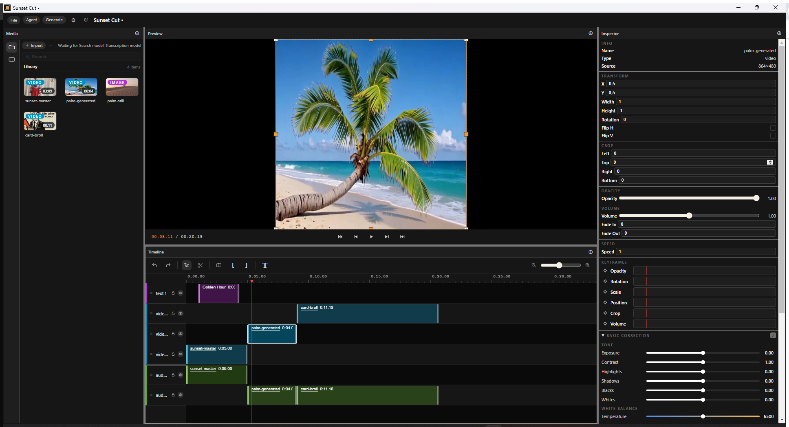

<div align="center">


[](https://github.com/x777/frontstage/releases/latest)
[](https://github.com/x777/frontstage/actions/workflows/ci.yml)
[](LICENSE)
[](https://ko-fi.com/frontstage)

**Cut, grade, caption, generate — on a real multi-track timeline.
Or just tell the agent what you want and watch it edit.**

<a href="https://frontstage.studio/studio">Open Studio in your browser</a> ·
<a href="https://github.com/x777/frontstage/releases/latest">Download for Windows</a>



<sub>That palm tree? Generated inside the editor, straight onto the timeline.</sub>

</div>

## What it does

| | |
|---|---|
| 🎬 **Real timeline editing** | Multi-track, ripple & razor tools, linked A/V, sync-locked tracks, keyframes on opacity/position/scale/crop/volume, snapping, frame-accurate trims |
| 🎨 **Color & effects** | 20 GPU effects: color wheels, curves & hue curves with histogram, LUTs (.cube), chroma key, blur/grain/glow, 16 blend modes |
| ✨ **AI generation** | Video, image, audio & TTS via [fal.ai](https://fal.ai) — Veo, Kling, Seedance, nano-banana and more. Your key, your cost control, results land in the library |
| 🤖 **The agent** | A chat that *edits your timeline*: cuts, layouts, color, captions — 40+ tools over the same undo stack you use. Any model via [OpenRouter](https://openrouter.ai) |
| 💬 **Captions & transcription** | On-device Whisper transcription (free, no key), word-level editing, 11 animated caption presets, remove filler words by text |
| 🔍 **Visual search** | Search your footage by what's *in* it — on-device SigLIP embeddings, no cloud |
| 🔌 **MCP server** | Point Claude (or any MCP client) at your project — 43 tools to edit it from the outside |
| 📤 **Pro interop** | Export FCPXML (DaVinci Resolve / Final Cut), XMEML (Premiere), SRT/VTT subtitles, MP4 render |

## Run it

- **Web** — [frontstage.studio](https://frontstage.studio): the full editor in your browser, no account, no keys needed for editing
- **Windows** — [download the installer](https://github.com/x777/frontstage/releases/latest) (unsigned: SmartScreen will warn — "More info → Run anyway")
- **macOS** — experimental unsigned dmg on the [Releases page](https://github.com/x777/frontstage/releases/latest) (untested on hardware, reports welcome)
- **From source** (Node 18+, pnpm 10):

  ```sh
  pnpm install
  pnpm -F @frontstage/desktop dev     # desktop app
  pnpm -F @frontstage/web dev         # web app
  ```

## Your keys, your data

AI features are strictly **bring-your-own-key**: fal.ai for generation, OpenRouter for the agent.
Keys live in your OS keychain (desktop) or your browser (web) — never on anyone's server.
Transcription and visual search run **entirely on your machine**, free. **Zero telemetry.**

## Let Claude edit your project (MCP)

The desktop app ships an MCP server (Settings → Agent → enable). Add it to Claude Code / Claude Desktop:

```json
{
  "mcpServers": {
    "frontstage": {
      "type": "http",
      "url": "http://127.0.0.1:19789/mcp",
      "headers": { "Authorization": "Bearer <token from Settings>" }
    }
  }
}
```

Then: *"split the interview at every silence and add captions"* — and watch your timeline change. 43 tools: editing, color, generation, transcription, export.

## Under the hood

pnpm + Turborepo monorepo — TypeScript end to end:

| Package | What it is |
|---|---|
| `packages/core` | Headless domain: timeline model, commands/undo, ripple engine, color math, captions, interop exporters — zero UI deps, 1000+ tests |
| `packages/engine` | Browser playback & render: WebGPU compositor (20 effects, 15 blends), WebCodecs decode, WebAudio mixing, MP4 export |
| `packages/ui` | The React editor — one `<Editor>` shared by web and desktop, token-driven design system |
| `packages/ai` | Agent loop, 43-tool catalog, fal.ai generation pipeline, on-device Whisper & SigLIP |
| `apps/desktop` | Electron shell: native FS, keychain, ffmpeg, the MCP server |
| `apps/web` | The same editor on File System Access API |
| `apps/proxy` | Self-host relay for web AI (your server, your keys) |

See [CONTRIBUTING.md](CONTRIBUTING.md) to get hacking.

## License & provenance

GPL-3.0. Frontstage is a cross-platform port of
[Palmier Pro](https://github.com/palmier-io/palmier-pro) (GPL-3.0) — see [NOTICE](NOTICE).

## Support the project

If Frontstage is useful to you: [Ko-fi](https://ko-fi.com/frontstage) · [crypto](DONATE.md) ❤️
